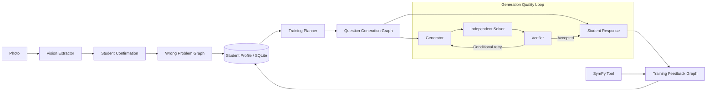

# Personalized Math Learning Agent

基于 LangGraph 的高中数学个性化学习 Agent：从错题拍照识别、错因诊断，到训练规划、可靠出题、学生反馈和长期画像更新。

**Status:** v1 Release Candidate

**Live Demo:** deployment pending

## Project Overview

MathLearningAgent 面向高中数学错题学习场景。学生可以拍照或上传教材图片，系统识别其中多道题目并要求学生确认；确认后的题目依次进入题目理解、错因诊断与长期画像更新。画像驱动个性化训练计划，Generator、Independent Solver 和 Verifier 协作生成并验证练习题；学生提交答案后，由 SymPy 与 LLM 共同评价，再将训练结果反馈到画像。

这是一条可追踪、可验证、可持续更新的学习闭环，而不只是聊天机器人。

## Core Features

- **Multi-problem Vision Intake**：从多张图片中提取多道题，先确认后入库。
- **Problem Understanding / Error Diagnosis**：结构化理解题目，在证据不足时保持 `unknown` 错因。
- **Student Profile**：累计错题与训练表现，维护知识点长期画像。
- **Personalized Training Planner**：根据薄弱知识点分配训练题量和难度。
- **Generator / Solver / Verifier**：独立生成、求解和审核题目。
- **Conditional Retry**：Verifier 未通过时由 LangGraph 条件边触发有限重试。
- **SymPy Deterministic Tool**：对支持的数学表达式进行确定性等价判断。
- **Student Feedback Loop**：评价学生作答并更新画像统计。
- **SQLite Long-term Memory**：保存错题、通过验证的生成题和训练记录。
- **Evaluation / Observability**：离线评测、调用计数、失败与耗时记录。
- **FastAPI Web UI**：覆盖错题录入、画像、规划、训练、历史和评测展示。

## Architecture



## Agent / Deterministic Boundary

LLM 负责需要语义理解与生成的任务：problem understanding、diagnosis、planning、generation、independent solving、verification 和 feedback。

确定性 Python 负责系统边界与可重复行为：Pydantic validation、SQLite persistence、State routing、conditional edges、SymPy 检查、profile counters、evaluation metrics 和 upload validation。图像识别与错题分析严格分离，Vision extraction 不会直接写数据库。

## Tech Stack

- Python 3.12
- LangGraph
- FastAPI / Uvicorn
- SQLite
- Pydantic
- SymPy
- DeepSeek OpenAI-compatible API
- HTML / CSS / JavaScript
- pytest

## Evaluation

第一次真实 Phase 7 Pilot 使用 10 道真实学生薄弱题，在后续 symbolic normalization patch 之前运行：

| Area | First Pilot Result |
| --- | --- |
| LLM observability | 22 calls，0 API failures |
| Solver | 5 symbolically verified equivalent，0 verified not-equivalent，4 unsupported，coverage 55.6% |
| Verified subset | 5/5 |
| Planner | weak-cluster allocation 100% |
| Generator | 3/3 accepted，average attempts 1.0 |
| Synthetic Verifier Challenge | 1 actual case；positive accepted，corrupted rejected |

这些结果只用于验证最小系统闭环，不能外推为总体模型能力：样本量小且集中于一个知识簇；没有学生解题过程或 error-type gold；`5/5` 只是可被符号验证的子集，不是总体 Solver accuracy；Generator matching 由 LLM Verifier 判断；没有 ablation baseline。符号 normalization patch 在这次 Pilot 之后加入，尚未重新运行真实实验，因此不宣称 coverage 已提高。

脱敏聚合指标保存在 [`docs/evaluation/pilot_summary.json`](docs/evaluation/pilot_summary.json)，原始 eval traces 保持 Git ignored。

## Web Demo Flow

上传或拍照 → 确认识别结果 → 批量录入错题 → 查看 Profile → 生成 Training Plan → Online Training → Feedback 与画像更新。

## Local Quick Start

```powershell
python -m venv .venv
.\.venv\Scripts\Activate.ps1
python -m pip install -r requirements.txt
Copy-Item .env.example .env
```

在 `.env` 中配置自己的 DeepSeek API Key、Base URL 和模型，然后运行：

```powershell
python -m scripts.run_web_app
```

访问 <http://127.0.0.1:8000>。本地不设置 `APP_ACCESS_USERNAME` 和 `APP_ACCESS_PASSWORD` 时不会启用 Basic Auth。

## Deployment

项目支持 Railway 注入的 `PORT`、可挂载 Volume 的 `DATABASE_PATH`，以及可选 HTTP Basic Authentication。部署状态：**Live Demo: deployment pending**。

具体步骤见 [`docs/DEPLOYMENT.md`](docs/DEPLOYMENT.md)。

## Tests

全部测试使用 fake clients 或本地临时数据库，不调用真实 DeepSeek API：

```powershell
python -m pytest -q
```

当前 Release 验证结果：`113 passed`。

## Privacy / Safety

- API Key 仅保留在服务端环境变量中。
- 上传图片只在内存中发送给 Vision API，不持久化到项目目录。
- 图片识别结果必须由学生确认，之后才会写入错题库。
- 参考答案在学生提交作答前不会通过生成题 API 暴露。
- 公网部署可启用 HTTP Basic Authentication。
- `.env`、SQLite 数据库、eval traces、日志与临时文件均排除在 Git 之外。

## Limitations

- Vision extraction 可能需要用户人工修正。
- 当前真实评测集规模较小且知识点分布集中。
- SymPy 仅处理当前支持的表达式格式。
- SQLite 适合当前单学生或小规模 Demo，不面向高并发多租户。
- LLM 输出仍具有概率性，Verifier 也不能替代人工质量审核。

## Project Structure

```text
math_learning_agent/   Core agents, graphs, models, tools, database and Web app
scripts/               Local demos, evaluation runner and Web entry point
tests/                 Offline unit and HTTP contract tests
evals/                 Evaluation dataset, metrics, runner and tracing code
docs/                  Deployment guide and sanitized evaluation summary
data/                  Local SQLite storage (database files are ignored)
outputs/               Local evaluation artifacts (ignored)
```
